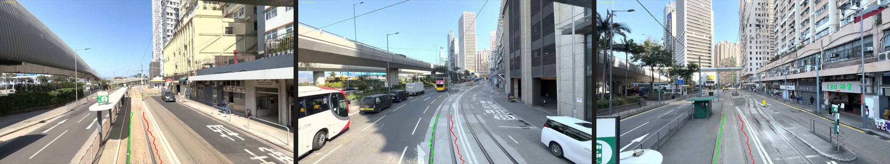
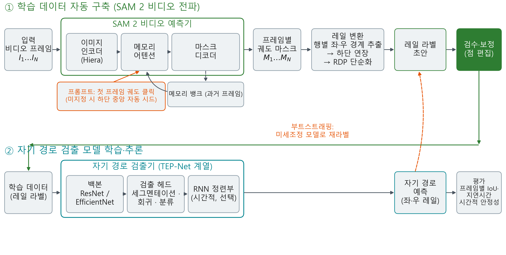
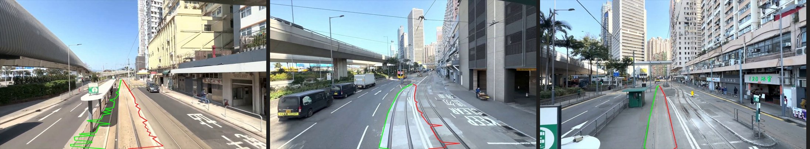

# SAM 2 비디오 마스크 전파를 활용한 철도 자기 경로 학습 데이터 반자동 구축 기법

**Semi-automatic Construction of Railway Ego-Path Training Data Using SAM 2 Video Mask Propagation**

---

김백현¹ · 황현철¹†

¹ 한국철도기술연구원
주저자: 김백현 (bhkim@krri.re.kr) · † 교신저자: 황현철 (hchwang@krri.re.kr)

> ※ 대한전자공학회 2026년 전자·반도체·인공지능 학술대회 발표용 요약 논문. 본 내용을 확장한 상세 연구(시간적 안정성 평가, 분기부 폐색 진단·처방 등)는 별도 학회지 논문으로 투고 예정.

---

## 요약

열차 전방 영상에서 주행 선로(자기 경로)를 검출하는 딥러닝 모델은 프레임마다 좌·우 레일을 지정하는 라벨링에 큰 비용이 들고, 학습에 쓰인 환경과 다른 노선에서는 정확도가 급락한다. 학습된 검출 모델로 라벨 초안을 만드는 자동 라벨링은 이 비용을 줄일 수 있으나, 정작 모델이 실패하는 신규 도메인에서는 초안 자체가 성립하지 않는다. 본 고에서는 파운데이션 세그멘테이션 모델 SAM 2의 비디오 마스크 전파를 이용하여, 첫 프레임에서 궤도를 한 번만 지정하면 영상 전체의 레일 라벨 초안이 만들어지는 반자동 학습 데이터 구축 기법을 제안한다. 전파된 궤도 마스크의 행별 좌·우 경계에서 레일 점열을 추출하고 폴리라인 단순화로 편집 가능한 소수의 제어점으로 축약하며, 초안 검수·보정과 모델 학습·재라벨까지 하나의 도구에서 이어지도록 구성하였다. 일반 철도 데이터로 학습된 기존 검출 모델이 동작하지 않는 도심 노면 전차 영상 290 프레임에 적용한 결과, 단일 프롬프트만으로 곡선 구간을 포함한 전 구간에서 사용 가능한 라벨 초안이 생성됨을 확인하였다. 나아가 초안 30장을 보정하여 모델을 미세조정하고 전체를 재라벨하는 부트스트래핑 1회로 대상 도메인의 초안 품질이 개선됨을 정성·정량으로 확인하였다.

**핵심어**: 자기 경로 검출, 학습 데이터 구축, 반자동 라벨링, SAM 2, 도메인 이동, 철도 인지

## Ⅰ. 서론

전방 카메라 기반 자기 경로(ego-path) 검출은 철도 자율주행·장애물 감시의 관심 영역을 결정하는 기반 기술이다. 최근 종단간 딥러닝 검출기[1]가 우수한 정확도를 보이지만, 학습 데이터 확보가 병목이다. 레일 라벨은 프레임마다 두 곡선을 사람이 그려야 하므로 비디오 단위 구축 비용이 크고, 공개 데이터셋[2,3]은 일반 간선철도 위주여서 노면 전차·경전철과 같이 궤도가 노면에 매립된 환경에는 학습된 모델이 그대로 적용되지 않는다. 새 노선마다 라벨링을 처음부터 반복해야 하는 셈이다.

학습된 검출 모델로 라벨 초안을 만드는 자동 라벨링은 이 비용을 줄일 수 있으나, 모델이 실패하는 신규 도메인에서는 초안 자체가 성립하지 않는다는 한계가 있다. 실제로 일반 철도 데이터로 학습된 세그멘테이션 검출기를 도심 노면 전차 영상에 적용하면, 예측이 궤도를 부분적으로만 따라가거나 인접 차량·승강장 경계로 이탈하여 보정의 기반으로 쓰기 어렵다(그림 1). 본 고는 이 한계를 파운데이션 모델로 우회한다. Segment Anything Model 2(SAM 2)[4]는 임의 객체를 프롬프트로 분할하고 그 마스크를 비디오 전체로 전파하므로, **레일을 학습한 적이 없어도** 사용자가 지정한 궤도 영역을 시퀀스 전반에서 추적할 수 있다. 이를 레일 라벨 형식으로 변환하는 후처리와 검수·학습 도구를 결합하여, 도메인에 무관하게 동작하는 반자동 학습 데이터 구축 파이프라인을 구성하였다.

**그림 1. 도메인 이동 하에서 기존 검출 모델의 실패.** 일반 철도로 학습된 세그멘테이션 검출기를 노면 전차 영상에 적용하면 자기 궤도를 벗어나 인접 궤도·승강장·주변 차량으로 이탈한다.

## Ⅱ. 제안 기법

제안 파이프라인은 세 단계로 구성된다(그림 2).

**(1) 궤도 프롬프트와 비디오 전파.** 사용자는 첫 프레임에서 자기 궤도 위의 한 점 이상을 마우스로 클릭한다(미지정 시 화면 하단 중앙을 자동 시드로 사용 — 자기 궤도는 차량 정면 하단에서 시작한다는 기하학적 사전지식). SAM 2 비디오 예측기가 해당 영역을 분할한 뒤 이후 모든 프레임으로 마스크를 전파한다. 프레임 간 외관 변화를 모델 내부 메모리로 추적하므로 별도의 모션 추정이 필요 없다.

**(2) 마스크→레일 변환.** 전파된 각 프레임의 궤도 마스크에서 세로 방향 격자(48행)를 따라 행별 최좌·최우 경계 화소를 취해 좌·우 레일 점열을 얻는다. 학습 규격에 맞도록 최하단 점을 영상 하단 경계까지 연장한 뒤, Ramer–Douglas–Peucker 단순화[5]로 형상을 보존하며 제어점 수를 축약한다. 직선 위주 구간에서는 레일당 평균 약 48점이 6점 내외로 줄어, 이후 수동 보정 시 다뤄야 할 점의 수가 크게 감소한다.

**(3) 검수·보정과 학습·재라벨 연계.** 생성된 초안은 라벨 편집 화면에 즉시 로드되어 점 단위 이동·추가·삭제로 보정할 수 있으며, 확정된 라벨은 동일 환경에서 검출 모델(세그멘테이션·회귀·분류 헤드)의 학습 입력으로 바로 사용된다. 소량 보정본으로 모델을 미세조정하면 그 모델로 나머지 프레임의 초안을 다시 생성하는 반복(부트스트래핑)이 가능한 구조다.

**그림 2. 제안 파이프라인의 전체 구성.** SAM 2 비디오 예측기(이미지 인코더–메모리 어텐션–마스크 디코더)가 첫 프레임 프롬프트를 전 프레임으로 전파해 궤도 마스크를 만들고, 레일 변환·검수를 거쳐 학습 데이터가 된다. 이 데이터로 자기 경로 검출기(백본–검출 헤드)를 학습하며, 미세조정 모델로 초안을 재생성하는 부트스트래핑 루프를 지원한다.

## Ⅲ. 실험

**설정.** 일반 간선철도 데이터셋 RailSem19[2]로 학습된 자기 경로 검출 모델과 제안 기법을, 학습 환경과 크게 다른 도심 노면 전차 주행 영상 290 프레임(1920×1080)에 각각 적용하였다. 노면 전차는 레일이 도로에 매립되어 침목·자갈 등 학습된 문맥 단서가 없고, 차선·횡단보도 등 레일과 유사한 선형 패턴과 차량 폐색이 많아 기존 모델에 불리한 조건이다.

**SAM 2 초안 생성.** 기존 학습 모델의 초안은 궤도를 부분적으로만 따라가거나 인접 차량·승강장으로 이탈하여(그림 1) 보정 기반으로 쓰기 어려웠다. 반면 제안 기법은 첫 프레임의 자동 시드만으로 290 프레임 전체에 궤도 마스크를 전파하였고, 추출된 좌·우 레일이 곡선 구간을 포함해 궤도 양측을 안정적으로 감쌌다(그림 3). 마스크 경계의 국소적 흔들림으로 일부 프레임에는 소폭의 점 보정이 필요하였으나, 전 프레임에서 초안이 성립한다는 점에서 기존 모델 기반 접근과 질적으로 구별된다.

**부트스트래핑 1회.** 의도된 사용 흐름 — SAM 2 초안 → 소량 수동 보정 → 미세조정 → 전체 재라벨 — 을 1회 수행하였다. 균등 추출한 30 프레임의 초안을 보정하여 세그멘테이션 모델을 미세조정하고 전체 290 프레임을 재라벨한 결과, 재라벨은 초기 초안의 지그재그·이탈이 사라지고 궤도를 매끄럽게 추종하여 잔여 보정 부담이 뚜렷이 감소하였다(그림 4). 미세조정 모델의 대상 도메인 IoU는 0.389에서 0.485로 상승하였다(보정에 쓰인 30장에 대한 in-sample 수치). 다만 기저망까지 미세조정한 대가로 원 도메인(RailSem19) IoU가 0.975→0.893으로 하락하는 파국적 망각이 관찰되었으며, 이는 도메인별 모델 분리 유지 또는 기저망 동결·혼합 학습으로 완화할 수 있다.

**그림 3. 노면 전차 영상에 대한 SAM 2 라벨 초안.** 처음·중간·끝 프레임에서 추출된 좌·우 레일이 매립 궤도를 안정적으로 추종한다.

**그림 4. 부트스트래핑 재라벨 비교.** 좌: 미세조정 이전 초안(지그재그·주변 객체로의 이탈). 우: 30 프레임 보정본으로 미세조정한 모델의 재라벨 — 곡선 구간을 포함해 궤도를 매끄럽게 추종한다.

## Ⅳ. 결론

본 고는 SAM 2의 비디오 마스크 전파를 레일 라벨 형식으로 변환하는 후처리와 검수·학습 도구에 결합하여, 학습 이력이 없는 신규 궤도 환경에서도 동작하는 반자동 학습 데이터 구축 기법을 제시하였다. 노면 전차 영상 실험에서 단일 프롬프트로 전 구간의 사용 가능한 초안이 생성됨을 확인하고, 초안 보정→미세조정→재라벨의 부트스트래핑 1회로 대상 도메인 초안 품질이 개선됨을 정성·정량으로 보였다. 향후 파국적 망각을 억제하는 도메인 적응, 반복 부트스트래핑의 정량 평가, 그리고 구축된 데이터로 학습한 모델의 시간적 안정성 분석으로 확장할 예정이다.

## 사사

본 연구는 한국철도기술연구원 주요사업 「철도 특화 로봇 기반 선로점검 핵심기술 개발(PK26312A1)」의 연구비 지원으로 수행되었습니다.

## 참고문헌

[1] T. Laurent, "Train Ego-Path Detection on Railway Tracks Using End-to-End Deep Learning," 2024.
[2] O. Zendel et al., "RailSem19: A Dataset for Semantic Rail Scene Understanding," *CVPR Workshops*, 2019.
[3] DZSF, "OSDaR23: Open Sensor Data for Rail 2023," 2023.
[4] N. Ravi et al., "SAM 2: Segment Anything in Images and Videos," 2024.
[5] D. Douglas and T. Peucker, "Algorithms for the Reduction of the Number of Points Required to Represent a Digitized Line or its Caricature," *Cartographica*, 10(2), 1973.
