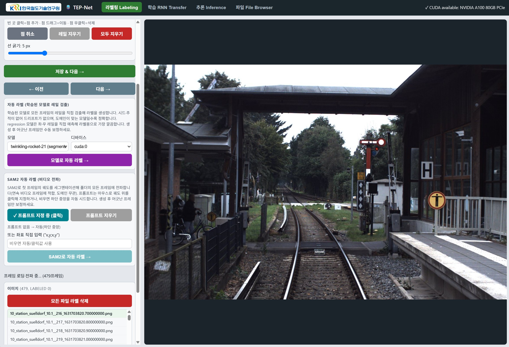
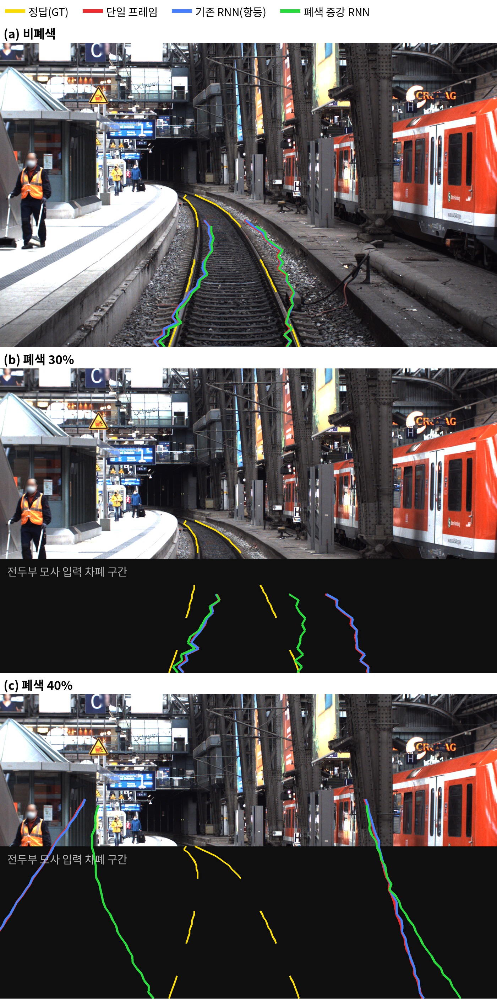
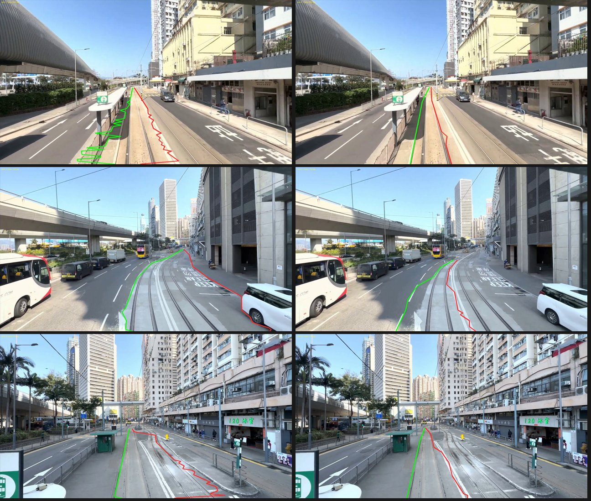
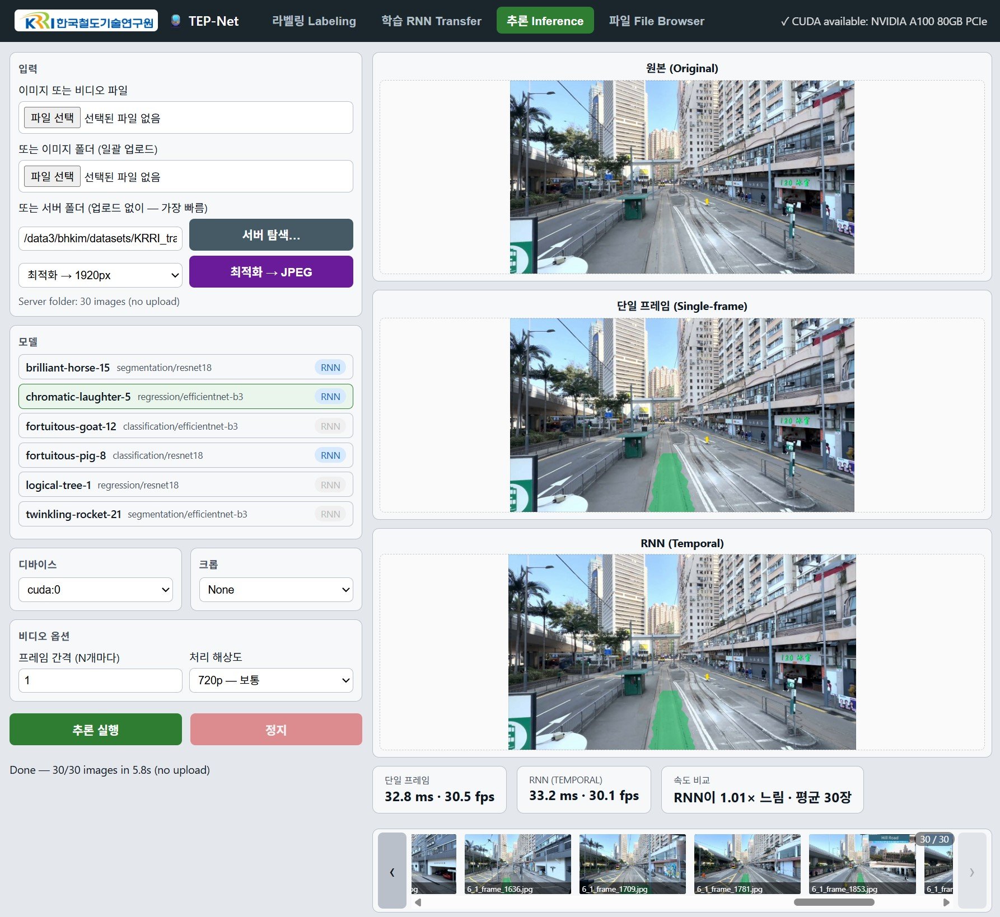

# 철도 자기 경로(Ego-Path) 검출을 위한 SAM2 기반 학습 데이터 자동 구축 및 학습·평가 파이프라인 구현

**Implementation of a SAM2-based Automatic Training-Data Construction and Training–Evaluation Pipeline for Railway Ego-Path Detection**

---

김백현¹ · 황현철¹†

¹ 한국철도기술연구원 (Korea Railroad Research Institute)
주저자: 김백현 (bhkim@krri.re.kr)
† 교신저자: 황현철 (hchwang@krri.re.kr)

**Baek-Hyun Kim¹ · Hyeon-Chyeol Hwang¹†**

> ※ 본 문서는 지금까지 개발·실험된 내용을 바탕으로 한 **투고용 초안**입니다. 참고문헌 서지사항(연도/권/페이지)은 제출 전 확인·보완이 필요합니다.

---

## 국문 초록

철도의 자율주행·운전 지원을 위해서는 열차가 주행 중인 선로, 즉 **자기 경로(ego-path)**를 영상에서 정확히 검출하는 기술이 요구된다. 특히 **분기부**에서는 열차가 분기기에 접근할수록 **전두부가 분기기 영역을 가려** 진로가 결정되는 바로 그 구간이 시야에서 사라지므로, 지난 프레임들에서 인식된 경로를 **시간적 메모리**로 유지·활용하는 보완이 필요하다. 본 논문은 이 목표 아래, (1) 학습용 **레일 라벨링 비용**, (2) 도메인 간 성능 급락(**도메인 이동**), (3) 라벨링–학습–추론–평가의 **작업 흐름 분절**이라는 세 가지 실무 병목을 함께 다룬다. Segment Anything Model 2(SAM 2)의 비디오 마스크 전파를 활용한 **도메인 무관 학습 데이터 자동 구축(반자동 라벨링) 파이프라인**과 이를 잇는 **통합 학습·평가 파이프라인**을 구현하고, 평가에는 프레임별 IoU에 더해 정답 라벨 없이 측정 가능한 **시간적 안정성 지표**(프레임 간 레일 지터, 예측 일관성 IoU)와 분기부 상황을 모사하는 **전두부 폐색 평가 프로토콜**(과거 프레임 정상, 현재 프레임 하단 차폐)을 제안하여 **진단–처방–검증**의 완결 절차를 수행하였다. 진단: OSDaR23 연속 시퀀스 13개(1,214 프레임)에서 RNN과 단일 프레임의 시간적 안정성이 완전히 동일하였고, 원시 출력 분석으로 잔차(residual) 구조의 RNN 정련부가 **항등 함수에 수렴**(편차 ≤ 0.06%)했음을 규명하였다. 그 귀결로, 분기부 시퀀스에서 폐색 40% 시 IoU가 0.68→0.19로 붕괴함에도 RNN은 과거 프레임의 정상 관측을 전혀 활용하지 못했다(Δ ≤ 0.001). 원인은 학습에 쓰이는 합성 유사-시퀀스에 폐색 시나리오가 없어 항등이 최적해가 되는 구조다. 처방·검증: 시퀀스의 **마지막 프레임 입력만 하단 차폐하고 타깃은 유지하는 폐색 증강**을 학습 파이프라인에 구현하고 균일 가중 손실로 정련부를 재학습한 결과, 비폐색 정확도를 유지하면서 학습 분포에서 폐색 유발 IoU 하락의 약 75%를 회복하였고(폐색 40%에서 0.943→0.961) 실영상 분기부에서도 일관된 부분 회복을 보였다 — 정련부가 "현재 프레임이 신뢰 불가능할 때 과거 관측을 사용"하는 게이팅을 학습한 것이다. 지터·교란 열화에는 단순 5프레임 이동평균이 정확도 손실 없이 유효함(지터 37–73% 감소)도 함께 보였다. 또한 학습 도메인과 크게 다른 노면 전차 영상에서 SAM 2 파이프라인이 단일 프롬프트만으로 유효한 초안 라벨을 생성함을 확인하고, 초안 30장 보정→파인튜닝→전체 재라벨의 **부트스트래핑 1회**로 대상 도메인 IoU가 0.389→0.485로 상승함을 실증하였다.

**핵심어**: 자기 경로 검출, 철도 인지, 분기부 폐색, 시간적 딥러닝, 반자동 라벨링, Segment Anything Model 2

## Abstract

Autonomous and driver-assistance systems for railways require accurate detection of the *ego-path*—the track the train is currently running on—from on-board camera images. Detection is hardest exactly where it matters most: at *turnouts*, the train's front end progressively occludes the switch area as the train approaches, hiding the very region where the route is decided. Compensating for this by keeping the previously recognized path in *temporal memory* is the central motivation of this work. To that end we also address three practical bottlenecks—costly rail labeling, domain shift, and a fragmented labeling–training–inference–evaluation workflow—by implementing a *domain-agnostic training-data construction (semi-automatic labeling) pipeline* built on the video mask-propagation of Segment Anything Model 2 (SAM 2) and an integrated training–evaluation pipeline. Beyond per-frame IoU, we propose ground-truth-free *temporal-stability metrics* (inter-frame rail jitter, prediction-consistency IoU) and a *nose-occlusion evaluation protocol* that mimics the turnout scenario (clean past frames, current frame masked from the bottom), and carry out a complete *diagnose–prescribe–verify* procedure. Diagnosis: on 13 continuous OSDaR23 sequences (1,214 frames) the RNN and single-frame temporal stability are exactly identical; raw-output analysis shows the residual RNN refiner has converged to a near-identity function (deviation ≤ 0.06%). Consequently, on turnout sequences the IoU collapses from 0.68 to 0.19 under 40% occlusion and the RNN recovers none of it (Δ ≤ 0.001)—the synthesized pseudo-sequences used for temporal training contain no occlusion, making identity the loss-optimal solution. Prescription and verification: we implement an *occlusion augmentation* that masks only the last frame's input while keeping its target, and retrain the refiner with a uniform-weight loss; the resulting model preserves clean accuracy while recovering about 75% of the occlusion-induced IoU drop in the training distribution (0.943→0.961 at 40% occlusion), with consistent partial recovery on real turnout footage—the refiner has learned to gate toward past observations when the current frame is unreliable. For jitter and per-frame perturbation, a simple 5-frame moving average remains effective (37–73% jitter reduction) at no accuracy cost. On tram footage far from the training domain, the SAM 2 pipeline produces usable draft labels from a single prompt, and one bootstrapping iteration (correct 30 drafts → fine-tune → relabel all 290) raises target-domain IoU from 0.389 to 0.485.

**Keywords**: ego-path detection, railway perception, turnout occlusion, temporal deep learning, semi-automatic labeling, Segment Anything Model 2

---

## 1. 서론

철도 자율주행과 운전 지원(ATO, 장애물 감지, 주의 구역 판단 등)의 기반 기술 중 하나는 전방 카메라 영상에서 **열차가 실제로 주행 중인 선로(자기 경로, ego-path)**를 검출하는 것이다. 자기 경로는 좌·우 두 레일로 표현되며, 이를 정확히 추정하면 관심 영역(region of interest) 한정, 전방 장애물의 궤도 내 존재 여부 판단 등에 직접 활용할 수 있다.

자기 경로 검출이 가장 어려워지는 대표적 상황은 **분기부(turnout) 통과**다. 분기부는 자기 경로가 둘로 갈라지는 유일한 지점이므로 진로 판단이 가장 중요한 곳인데, 정작 열차가 분기기에 접근하면 **차축이 분기기를 통과하기 직전 구간에서 전두부(차체 선단)가 분기기 영역을 가려**, 현재 프레임의 하단 — 진로가 결정되는 바로 그 영역 — 이 시야에서 사라진다. 프레임을 독립적으로 처리하는 단일 프레임 검출기는 이 구간에서 자기 경로를 놓치거나 잘못된 분기 방향으로 이탈할 수 있다. 반면 분기기는 가려지기 **이전** 프레임들에서 이미 관측·인식되었으므로, **지난 프레임들에서 인식된 경로를 메모리로 유지**하면 가려진 구간의 자기 경로를 보완할 수 있다. 이것이 본 연구가 다루는 시간적(RNN) 자기 경로 검출 모델의 핵심 동기이며, 본 논문의 평가·진단·처방은 모두 "시간적 메모리가 실제로 이 보완 기능을 수행하는가"라는 질문을 중심으로 구성된다.

최근 자기 경로 검출은 세그멘테이션·회귀·분류 등 다양한 딥러닝 정식화로 접근되어 높은 성능을 보이고 있다[TEP-Net]. 그러나 실무 적용에는 다음의 어려움이 있다.

1. **라벨링 비용**: 프레임마다 두 레일을 사람이 지정해야 하며, 수백~수천 프레임의 비디오를 라벨링하는 데 큰 노력이 든다.
2. **도메인 이동**: 공개 일반철도 데이터셋(예: RailSem19[RailSem19])으로 학습한 모델은 노면 전차(tram)와 같이 배경·궤도 형상·설치 환경이 크게 다른 도메인에서 성능이 급격히 저하된다.
3. **작업 흐름 분절**: 라벨링, 학습, 추론, 평가가 서로 다른 스크립트/환경으로 나뉘어 있어, 데이터 수집→라벨→학습→검증의 반복(iteration)이 비효율적이다.

본 논문은 이 문제들을 실무적으로 완화하기 위한 **SAM2 기반 학습 데이터 자동 구축 및 학습·평가 파이프라인**을 구현한다. 주요 기여는 다음과 같다.

- **SAM 2 기반 학습 데이터 자동 구축(도메인 무관 비디오 자동 라벨링)**: 첫 프레임에서 궤도 영역을 한 번 프롬프트하면 SAM 2가 전체 프레임에 마스크를 전파하고, 그 경계에서 좌·우 레일을 추출하여 학습 데이터를 자동 구축한다. 학습 데이터 도메인과 무관하게 동작하여 도메인 이동 문제 하에서의 라벨링 부트스트랩에 유효하다.
- **통합 학습·평가 파이프라인**: 단일 통합 환경에서 (i) 라벨링, (ii) 단일/시간적 모델 학습, (iii) 이미지·비디오·폴더 추론, (iv) 정량 평가를 일관되게 수행하여, 데이터 구축→학습→검증의 반복 주기를 단축한다.
- **시간적 안정성·폐색 평가와 진단–처방–검증 절차**: 정답 라벨 없이 연속 시퀀스에서 측정 가능한 시간적 지터·일관성 IoU 지표, 분기부 폐색을 모사하는 **전두부 폐색 평가 프로토콜**(과거 프레임은 정상, 현재 프레임 하단을 차폐), 그리고 동일 forward pass에서 단일/RNN 예측을 동시 산출하는 통제된 비교 프로토콜을 제안한다. 이를 통해 잔차형 RNN 정련부가 항등 함수로 수렴하여 폐색 보완이라는 본연의 기능을 수행하지 못하는 **조용한 실패(silent failure)**를 진단한다.
- **폐색 증강 학습(처방)**: 진단된 원인 — 학습 시퀀스에 폐색 시나리오가 없어 항등이 최적해가 되는 구조 — 을 겨냥해, 시퀀스 학습 데이터의 **마지막 프레임 입력만 하단 차폐하고 타깃은 유지**하는 폐색 증강을 학습 파이프라인에 구현한다. 가려진 경로의 정답이 과거 프레임에서만 복원 가능해지므로 항등 해가 더 이상 최적이 아니게 되며, 이렇게 학습된 RNN이 폐색 하에서 자기 경로를 실제로 보완하는지를 동일 프로토콜로 검증한다. 아울러 학습 기반 처방과 비학습 처방(단순 시간 필터)을 동일 지표로 비교한다.
- **단일 프레임 대 RNN 비교 및 실무 개선**: 평가를 단일/시간적 모델 모두로 확장하고, 다중 GPU 학습, 자동 라벨 점 단순화, 지연시간 비교 지표 등 반복 효율을 높이는 기능을 제공한다. 또한 다중 GPU + RNN 검증 시의 실행 오류를 진단·수정하였다.

실험에는 두 공개 철도 데이터셋을 사용한다. **RailSem19**[RailSem19]는 철도 주행 시점의 다양한 장면 약 8,500장에 주석을 제공하는 대표적 정지 영상 데이터셋이고, **OSDaR23**[OSDaR23]은 독일 철도 환경에서 카메라 등 다중 센서로 취득한 **연속 주행 시퀀스**를 제공하는 데이터셋이다. RailSem19에서의 정량 비교, OSDaR23 연속 시퀀스에서의 진단–처방–검증 실험, 노면 전차 영상에 대한 SAM 2 라벨링의 정성 결과를 제시하고, 시간적 안정화의 달성 가능 여지와 학습형 시간 모듈의 한계·재설계 방향을 논한다.

## 2. 관련 연구

**자기 경로/레일 검출.** 자율주행의 차선 검출과 유사하게, 철도에서는 두 레일을 곡선으로 추정한다. 자기 경로 검출을 종단간(end-to-end) 딥러닝으로 정식화한 연구[TEP-Net]는 백본(ResNet, EfficientNet 계열)과 검출 헤드(세그멘테이션/회귀/분류)를 조합하고, 시간적 정보를 반영하기 위한 순환(RNN) 확장을 제시하였다. 본 연구는 이 계열의 모델을 기반으로 도구·평가·라벨링 측면을 확장한다.

**철도 인지 데이터셋.** RailSem19[RailSem19]는 의미론적 철도 장면 이해를 위한 대표적 공개 데이터셋이며, OSDaR23[OSDaR23]는 다중 센서 철도 데이터셋이다. 이들 데이터셋은 일반 철도 중심이어서, 노면 전차와 같은 도심 궤도에는 도메인 차이가 존재한다.

**파운데이션 세그멘테이션 모델.** Segment Anything Model(SAM)[SAM]은 점·박스 프롬프트로 임의 객체를 분할하는 파운데이션 모델이며, 후속 SAM 2[SAM2]는 이를 **비디오로 확장하여 한 프레임의 프롬프트를 전체 시퀀스에 전파**한다. 본 연구는 SAM 2의 이 특성을 철도 궤도 라벨링에 활용한다.

**폴리라인 단순화.** 검출된 레일은 다수의 점으로 표현되는데, 직선 구간에서는 과다 표현이 된다. 본 연구는 Ramer–Douglas–Peucker(RDP) 알고리즘[RDP]으로 형상을 보존하며 점 수를 줄인다.

## 3. 제안 시스템

### 3.1 전체 구조

제안 시스템은 Python/Flask 백엔드와 단일 페이지 웹 프론트엔드로 구성되며, 다섯 개의 탭(업로드/파일 브라우저, 라벨링, 학습, 추론, 평가 연계)으로 라이프사이클을 포괄한다. 서버는 GPU에서 모델을 적재하여 추론·학습·SAM 2 전파를 수행하고, 프론트엔드는 서버-전송 이벤트(SSE)로 진행 상황을 실시간 표시한다. 파일 브라우저는 각 패널을 **로컬(File System Access API)** 또는 **서버**로 선택할 수 있어, 브라우저에서 로컬↔서버 간 업로드/다운로드와 서버 파일 관리를 함께 수행한다.

### 3.2 자기 경로 검출 (단일 프레임 · 시간적 RNN)

검출 모델은 백본으로 특징을 추출하고 검출 헤드로 좌·우 레일을 추정한다. 세그멘테이션 헤드는 궤도 마스크를, 회귀/분류 헤드는 각 레일의 점열을 직접 산출한다. 시간적 모델은 단일 프레임 기저망(base net) 위에 순환 정련부(RNN refiner)를 두어, 최근 `seq_len`(=5) 프레임의 기저망 출력(인식된 경로)을 **메모리 버퍼**로 유지하고 이를 종합해 현재 프레임의 경로를 정련한다 — 서론에서 기술한 분기부 폐색 보완이 이 메모리의 목적이다. 시스템은 단일 프레임 모델과 그에 대응하는 RNN 모델(전이학습)을 함께 관리한다.

**폐색 증강(occlusion augmentation).** 시간적 학습은 정지 영상 데이터셋에서 크롭 박스 보간으로 합성한 유사-시퀀스를 사용하는데, 원 구성에는 폐색 시나리오가 없어 "마지막 프레임의 기저 예측을 그대로 복사"하는 항등 해가 손실 관점의 최적이 된다(4.2절 진단). 이를 겨냥해 본 연구는 시퀀스의 **마지막(현재) 프레임 입력에만** 확률 p로 하단 폐색 밴드(높이 비율 U(0.1, 0.4), 전두부 모사 암색)를 적용하고 **타깃은 그대로 유지**하는 증강을 구현하였다. 가려진 하단 경로의 정답은 과거 프레임에서만 관측 가능하므로, 정련부가 메모리를 실제로 활용해야만 손실이 감소한다.

### 3.3 반자동 라벨링

**(a) 모델 기반 자동 라벨.** 학습된 검출 모델을 폴더의 모든 프레임에 적용해 초안 라벨을 생성한다. 회귀 모델은 좌·우 레일 점열을 직접 산출하여 가장 깔끔하며, 세그멘테이션 모델은 마스크의 행별 최좌·최우 경계로 레일을 추출한다.

**(b) 점 단순화.** 추출된 레일에 RDP 단순화를 적용하여 직선 구간을 소수의 점으로 축약한다(끝점 보존, 하단 프레임 경계까지 연장). 실험에서 레일당 평균 점 수가 약 48점에서 6점 내외로 감소하여, 이후 수동 보정 부담을 크게 낮추었다.

**(c) SAM 2 비디오 전파 (핵심).** 연속 프레임(비디오)에 대해, 사용자가 **첫 프레임에서 궤도 위 한 점 이상을 클릭**(또는 하단 중앙 자동 시드)하면, SAM 2 비디오 예측기가 궤도 영역을 분할하고 **이후 모든 프레임으로 마스크를 전파**한다. 각 프레임 마스크의 좌·우 경계를 행 격자에서 추출하고 RDP로 단순화하여 좌·우 레일 라벨을 생성한다(그림 1). 이 과정은 학습 데이터 도메인과 무관하므로, 학습 모델이 실패하는 도메인에서도 라벨 초안을 얻을 수 있다. 프론트엔드는 라벨링 캔버스에서 프롬프트 점을 마우스로 지정·삭제할 수 있게 하고, SSE로 전파 진행률을 표시한다.

**그림 1. 라벨링 화면.** 좌측에 학습 모델 기반 자동 라벨과 SAM 2 자동 라벨(비디오 전파) 패널이 있으며, SAM 2 프롬프트는 캔버스에서 마우스 클릭으로 지정한다(OSDaR23 연속 시퀀스 479 프레임 로드 상태).

### 3.4 학습 (다중 GPU 및 안정성)

파이프라인은 method(회귀/분류/세그멘테이션)·백본·에폭·학습률·배치 크기·GPU를 지정해 학습을 시작하고, 로그·손실을 실시간으로 표시한다. 다중 GPU 학습은 `DataParallel`로 배치를 분할한다. 이 과정에서, **시간적(RNN) 모델을 다중 GPU로 검증할 때 실행 오류**가 발생함을 확인하였다. 원인은 검증 컨텍스트가 `torch.inference_mode()`로 텐서를 추론 텐서(inference tensor)로 표시하는데, `DataParallel`이 모듈을 복제하며 cuDNN RNN의 `flatten_parameters()`가 해당 가중치를 제자리(in-place) 갱신하려다 실패하는 것이다. 검증 컨텍스트를 `torch.no_grad()`로 변경하여 문제를 해소하였다(2 GPU DataParallel + RNN 학습이 검증 단계에서 정상 통과함을 확인).

### 3.5 평가

평가 도구를 단일 프레임 가중치(`egopath/weights`)와 RNN 가중치(`egopathrnn/weights`) 모두를 스캔하도록 확장하고, 결과에 모델 유형(single/rnn) 열을 추가하였다. IoU 평가는 예측 자기 경로를 마스크로 변환하여 정답 마스크와의 교집합/합집합으로 산출한다. 아울러 추론 화면에서 프레임별로 **단일 프레임과 RNN의 검출 지연시간·FPS**를 측정·표시하여 속도 비교를 지원한다.

**시간적 안정성 지표.** 프레임별 IoU는 독립 프레임에서의 정확도만 반영하므로, 시간적 모델의 목적인 **프레임 간 예측 안정성**을 평가하기 위해 정답 라벨이 필요 없는 두 지표를 정의한다. 연속 시퀀스의 각 프레임 t에 대해 예측 좌·우 레일을 고정 y-격자(48행)에서 x좌표로 표본화할 때,

- **시간적 지터(temporal jitter)**: 연속 프레임 쌍의 공통 y-구간에서 좌·우 레일 x좌표의 평균 절대 변위(px), 즉 mean |x_t − x_{t−1}|. 값이 작을수록 예측이 안정적이다.
- **일관성 IoU(consistency IoU)**: 연속 프레임의 예측 자기 경로 마스크 간 IoU(pred_t, pred_{t−1}). 값이 클수록 프레임 간 예측이 일관된다.

카메라(차량) 이동에 의한 실제 장면 변화는 두 비교 대상(단일/RNN)에 동일하게 작용하므로, 동일 시퀀스에서의 상대 비교는 공정하다. 특히 본 시스템의 시간적 모델은 단일 forward pass에서 **기저망의 프레임별 예측과 RNN 정련 예측을 동시에 산출**(`detect_pair`)하므로, 기저 특징이 완전히 공유된 **통제된 비교**가 가능하다 — 두 결과의 차이는 순수하게 RNN 정련부의 효과이다.

## 4. 실험 및 결과

### 4.1 단일 프레임 대 RNN (RailSem19)

RailSem19의 라벨(약 7,900장)에서 시드 고정 분할의 테스트 부분(약 792장)을 대상으로, 여섯 개 단일 프레임 모델과 세 개 RNN 모델의 프레임별 IoU를 측정하였다(표 1). 정상 학습된 RNN 모델은 대응 단일 프레임 모델과 **거의 동일한 IoU**를 보였다(표 2, ΔIoU ≈ −0.001 ~ −0.003).

**표 1. RailSem19 테스트 분할에서의 프레임별 IoU**

| 모델 | 유형 | method/backbone | IoU |
|---|---|---|---|
| twinkling-rocket-21 | single | segmentation / efficientnet-b3 | 0.9777 |
| chromatic-laughter-5 | single | regression / efficientnet-b3 | 0.9761 |
| brilliant-horse-15 | single | segmentation / resnet18 | 0.9754 |
| brilliant-horse-15RNN | rnn | segmentation / resnet18 | 0.9741 |
| chromatic-laughter-5RNN | rnn | regression / efficientnet-b3 | 0.9732 |
| logical-tree-1 | single | regression / resnet18 | 0.9698 |
| fortuitous-goat-12 | single | classification / efficientnet-b3 | 0.9665 |
| fortuitous-pig-8 | single | classification / resnet18 | 0.9645 |

**표 2. 기저 모델 → RNN의 IoU 변화**

| 기저 모델 | single IoU | RNN IoU | Δ IoU |
|---|---|---|---|
| brilliant-horse-15 | 0.9754 | 0.9741 | −0.0013 |
| chromatic-laughter-5 | 0.9761 | 0.9732 | −0.0029 |

프레임별 IoU에서 RNN의 우위가 나타나지 않았다. 그 원인이 (i) 독립 프레임 지표가 시간적 이점을 포착하지 못해서인지, (ii) RNN 정련부 자체가 실효적이지 않아서인지 판별하기 위해, 4.2절의 시간적 안정성 평가를 수행하였다.

### 4.2 시간적 안정성 평가 (단일 프레임 대 RNN)

OSDaR23[OSDaR23]의 연속 rgb_center 시퀀스 중 40프레임 이상인 **13개 시퀀스(총 1,214 프레임)**를 대상으로, 3.5절의 통제된 프로토콜(`detect_pair`: 동일 forward pass에서 단일/RNN 예측 동시 산출, 시퀀스 시작 시 시간 상태 초기화)로 시간적 지터와 일관성 IoU를 측정하였다(표 3).

**표 3. 연속 시퀀스(13개, 1,214 프레임)에서의 시간적 안정성**

| 모델 (method/backbone) | 지터 px (single) | 지터 px (RNN) | 일관성 IoU (single) | 일관성 IoU (RNN) |
|---|---|---|---|---|
| brilliant-horse-15RNN (segmentation/resnet18) | 13.77 | 13.77 | 0.9592 | 0.9592 |
| chromatic-laughter-5RNN (regression/efficientnet-b3) | 2.56 | 2.56 | 0.9820 | 0.9814 |

놀랍게도 두 모델 모두에서 단일 프레임과 RNN의 시간적 안정성이 **사실상 완전히 동일**하였다. 이 원인을 규명하기 위해 디코딩 전 **원시 출력**을 직접 비교한 결과, RNN 정련 출력과 기저망 출력의 차이는 세그멘테이션 모델에서 로짓 스케일(≈90) 대비 최대 0.057(≈0.06%), 회귀 모델에서 출력 스케일(≈0.65) 대비 최대 0.003(≈0.45%)에 불과하였다. 즉 **RNN 정련부가 항등 함수에 가깝게 수렴**한 것이다.

구조적 원인은 정련부의 설계와 학습 데이터에 있다. 정련부는 마지막 프레임의 기저 예측에 **잔차(residual)를 더하는 구조**이며 출력층이 0으로 초기화되어, 학습 시작 시점에 정확히 기저 예측을 재현한다. 현재의 시간적 전이학습은 정적 이미지 데이터셋에서 증강으로 합성한 유사-시퀀스를 사용하는데, 이 시퀀스에는 **현재 프레임에서 경로가 가려지는 폐색 시나리오가 없다**. 마지막 프레임만으로 타깃이 완전히 결정되므로 손실 관점에서 잔차를 0 부근에 유지하는 것이 최적이고, 결과적으로 정련부가 항등에서 벗어날 유인이 없다. 이 발견은 세 가지 함의를 가진다. 첫째, 4.1절에서 RNN의 IoU가 단일 프레임과 거의 같았던 것은 지표의 한계가 아니라 **모델이 기능적으로 동일**하기 때문이다. 둘째, 항등으로 수렴한 정련부는 과거 프레임의 메모리를 사용하지 않으므로, 서론에서 동기로 제시한 **분기부 전두부 폐색의 보완 기능이 부재**함을 뜻한다 — 이는 4.3절에서 폐색 프로토콜로 직접 확인된다. 셋째, 제안한 시간적 안정성 지표와 통제된 비교 프로토콜은 이러한 **시간적 모듈의 비실효성(silent failure)을 정량적으로 진단**하는 도구로 유효하다.

부수적으로, 검출 헤드 간 비교에서 회귀 모델(2.56 px, 0.982)이 세그멘테이션 경계 추출(13.77 px, 0.959)보다 시간적으로 훨씬 안정적임이 관찰되었다. 이는 연속 프레임 응용에서 회귀 정식화가 유리할 수 있음을 시사한다.

### 4.3 분기부 전두부 폐색 진단

서론의 핵심 시나리오 — 전두부가 분기기를 가려 현재 프레임 하단의 자기 경로가 보이지 않는 상황 — 에서 시간적 메모리가 실제로 경로를 보완하는지를 직접 측정하였다. **폐색 프로토콜**: 연속 시퀀스의 각 프레임 t에 대해, 정련부 윈도우의 **과거 4프레임은 정상 영상**의 기저 출력(분기기가 가려지기 전 관측을 모사), **현재 프레임은 하단 h%를 전두부 모사 암색 밴드로 차폐**한 영상의 기저 출력으로 구성하고, 현재 프레임의 정답 라벨로 IoU를 측정한다(h ∈ {0, 10, 20, 30, 40}). 단일 프레임 예측(차폐된 현재 프레임의 기저 출력)과 RNN 정련 예측이 동일 기저 특징을 공유하므로, 두 결과의 차이는 순수하게 메모리 활용의 효과다.

평가 데이터는 (i) **OSDaR23 역 구내 연속 시퀀스 3개(30프레임, 사람 검수 정답 라벨)** — 분기부 통과·접근 장면을 포함하여 표적 시나리오에 부합 — 와 (ii) RailSem19 테스트 분할의 의사-시퀀스 300개(학습 분포와 동일)이다. 결과는 표 4와 같다.

**표 4. 전두부 폐색 진단: 폐색 높이별 정답 IoU (단일 프레임 / RNN)**

| 폐색 높이 | OSDaR23 분기부 시퀀스 (single) | OSDaR23 분기부 시퀀스 (RNN) | RailSem19 의사-시퀀스 (single) | RailSem19 의사-시퀀스 (RNN) |
|---|---|---|---|---|
| 0% | 0.677 | 0.678 | 0.968 | 0.966 |
| 10% | 0.654 | 0.655 | 0.967 | 0.965 |
| 20% | 0.630 | 0.629 | 0.965 | 0.963 |
| 30% | 0.442 | 0.442 | 0.957 | 0.955 |
| 40% | 0.190 | 0.190 | 0.943 | 0.941 |

두 가지가 관찰된다. 첫째, 직선 위주의 RailSem19에서는 폐색에도 IoU가 완만하게 하락한다(0.968→0.943) — 가려진 하단을 보이는 상단 레일의 연장선으로 외삽할 수 있기 때문이다. 그러나 **경로가 갈라지는 분기부 시퀀스에서는 외삽이 성립하지 않아 IoU가 붕괴한다**(30%에서 0.44, 40%에서 0.19). 즉 폐색 취약성은 정확히 분기부 — 진로 판단이 가장 중요한 지점 — 에서 심각하다. 둘째, 모든 폐색 수준에서 **RNN과 단일 프레임의 차이가 Δ ≤ 0.001**로, 과거 4프레임의 정상 관측이 메모리에 있음에도 정련부는 이를 전혀 활용하지 못했다. 이는 4.2절의 항등 수렴 진단과 정확히 일치하며, 현재의 시간적 전이학습으로는 분기부 폐색 보완이라는 본연의 목적이 달성되지 않음을 정량적으로 보여준다.

### 4.4 처방과 검증: 시간적 정련의 실효화

4.2–4.3절의 진단에 대한 처방으로 세 접근을 동일 지표로 검증하였다. 이하 실험은 회귀 모델(chromatic-laughter-5RNN)을 대상으로, 13개 연속 시퀀스를 **학습 9개 / 보류(held-out) 4개**로 시퀀스 단위 분할하고, 별도의 **실제 라벨 연속 시퀀스 3개(30 프레임)**를 정답 IoU 확인에 사용하였다. 아울러 악천후·모션 블러 등으로 인한 프레임 단위 추정 열화를 모사하기 위해, 기저망 출력 벡터에 가우시안 교란(σ=0.008, 출력 스케일의 약 1.2%)을 세 비교 대상에 동일하게 주입한 조건도 평가하였다.

**(a) 학습 기반 처방(시간적 손실 재학습).** 실제 연속 시퀀스의 기저 출력 위에서, 시간적 노이즈-제거 목적(교란된 5프레임 윈도우로부터 현재 프레임의 깨끗한 출력 복원)과 일관성 손실(연속 정련 출력 차이 벌점, λ=0.3)로 정련부를 재학습하였다(Adam, 300 epochs). 그러나 재학습된 정련부는 여전히 항등 부근에 머물렀고(기저 대비 편차 최대 0.3%), 보류 시퀀스에서 지터·일관성의 개선이 없었으며(표 5), RailSem19 프레임별 IoU는 오히려 소폭 하락하였다(0.9732 → 0.9661). 이는 0-초기화 잔차 구조와 현재 손실 하에서 항등이 강한 국소 최적으로 작용하여, 손실만 바꾸는 재학습으로는 벗어나기 어려움을 시사한다.

**(b) 비학습 처방(단순 시간 필터).** 동일한 기저 출력에 지수이동평균(EMA, α=0.5)과 5프레임 이동평균(boxcar-5)을 적용한 결과, 시간적 안정성이 크게 개선되었다(표 5). 정상 조건에서 boxcar-5는 지터를 37% 감소시키고(3.80→2.39 px) 일관성 IoU를 0.9769→0.9850으로 높였으며, **정답 IoU 손실이 없었다**(0.6769→0.6775). 교란 조건에서는 효과가 더 커서, 지터 73% 감소(19.17→5.11 px), 일관성 IoU 0.8999→0.9712, 그리고 교란으로 하락한 정답 IoU(0.6729)를 **정상 수준(0.6772)으로 회복**시켰다.

**표 5. 처방별 시간적 안정성과 정확도 (보류 시퀀스 4개; 정답 IoU는 라벨 시퀀스 30프레임)**

| 조건 | 방법 | 지터 (px) | 일관성 IoU | 정답 IoU |
|---|---|---|---|---|
| 정상 | 단일 프레임 | 3.80 | 0.9769 | 0.6769 |
| 정상 | RNN 재학습 (a) | 3.79 | 0.9769 | 0.6765 |
| 정상 | EMA α=0.5 (b) | 2.63 | 0.9839 | 0.6771 |
| 정상 | **boxcar-5 (b)** | **2.39** | **0.9850** | **0.6775** |
| 교란 σ=0.008 | 단일 프레임 | 19.17 | 0.8999 | 0.6729 |
| 교란 σ=0.008 | RNN 재학습 (a) | 19.15 | 0.9001 | 0.6734 |
| 교란 σ=0.008 | EMA α=0.5 (b) | 8.56 | 0.9536 | 0.6753 |
| 교란 σ=0.008 | **boxcar-5 (b)** | **5.11** | **0.9712** | **0.6772** |

다만 단순 필터는 지터·경미한 교란에는 유효해도 **분기부 폐색에는 원리적 한계**가 있다. 필터는 오염된 현재 출력을 평균에 그대로 포함하며, 폐색으로 소실된 구조를 새로 만들어내지 못하기 때문이다. 폐색 보완에는 "현재 프레임이 신뢰 불가능할 때 과거 관측을 선택적으로 사용"하는 **학습된 게이팅**이 필요하며, 이것이 (c)의 폐색 증강 학습이다.

**(c) 폐색 증강 학습(제안 처방).** 3.2절의 폐색 증강 — 시퀀스의 마지막 프레임 입력만 확률 0.5로 하단 차폐, 타깃 유지 — 으로 항등 최적해를 제거하고, 동결 기저망 위에서 정련부를 재학습하였다. 여기서 추가 진단이 하나 얻어졌다. **표준 학습 레시피(원근 가중 손실)에 폐색 증강만 더한 재학습은 여전히 항등으로 수렴**하였는데(전 폐색 수준에서 |Δ| ≤ 0.005), 원근 가중이 하단(=폐색 영역) 앵커의 벌점을 상단 대비 10배 이상 낮게 두는 데다, 직선 위주 데이터에서는 차폐된 프레임의 외삽 출력이 실제 직선 선로의 출력과 구별되지 않아 학습 신호가 희석되기 때문이다. 이에 폐색 복원이 목표인 정련부 학습에는 **균일 가중 궤도 손실**을 사용하였다(기저망이 동결되어 있으므로 기저 출력을 캐시하고 정련부만 재학습; Adam, lr 10⁻³, 300 epochs). 학습된 모델(폐색 증강 RNN)을 4.3절의 폐색 프로토콜로 검증한 결과는 표 6과 같다.

**표 6. 폐색 증강 학습의 검증: 폐색 높이별 정답 IoU (단일 프레임 / 기존 RNN / boxcar-5 / 폐색 증강 RNN)**

| 데이터 | 폐색 높이 | 단일 프레임 | 기존 RNN | boxcar-5 | **폐색 증강 RNN** |
|---|---|---|---|---|---|
| RailSem19 의사-시퀀스 | 0% | 0.968 | 0.966 | 0.864 | 0.967 |
| | 20% | 0.965 | 0.963 | 0.864 | 0.967 |
| | 30% | 0.957 | 0.955 | 0.864 | **0.965** |
| | 40% | 0.943 | 0.941 | 0.862 | **0.961** |
| OSDaR23 분기부 시퀀스 | 0% | 0.677 | 0.678 | 0.677 | 0.674 |
| | 20% | 0.630 | 0.629 | 0.668 | 0.644 |
| | 30% | 0.442 | 0.442 | **0.609** | 0.481 |
| | 40% | 0.190 | 0.190 | **0.516** | 0.232 |

학습 분포(RailSem19)에서 폐색 증강 RNN은 **비폐색 정확도를 유지하면서(0.967 대 0.968) 폐색 40%에서 IoU를 0.943→0.961로 회복** — 폐색으로 인한 하락(0.968→0.943)의 약 75%를 되찾았다. 정련부가 "현재 프레임이 신뢰 가능하면 항등, 아니면 과거 관측 활용"이라는 **게이팅을 학습**한 것으로, 잔차형 정련부가 항등을 벗어나 본연의 기능을 수행한 첫 사례다(그림 2). 도메인 밖 실영상 분기부에서도 방향은 일관되나 회복 폭이 부분적이었다(30%에서 0.442→0.481, 40%에서 0.190→0.232). 흥미롭게도 boxcar-5의 양상은 정반대다: 저속 진입의 실영상(프레임 간 정렬 양호)에서는 강력하지만(40%에서 0.516), 카메라 운동이 있는 의사-시퀀스에서는 **비폐색 정확도를 크게 훼손**한다(0.968→0.864). 즉 필터는 프레임 간 정렬에 민감한 무차별 평균이고, 학습형 게이팅은 비폐색 무손실이나 학습 분포 밖 일반화가 남은 과제다.

**그림 2. 전두부 폐색 검증 예(OSDaR23 함부르크 중앙역 구내 분기 구간 — 자기 경로가 분기기들을 지나 좌측으로 갈라져 나가는 장면).** (a) 비폐색. (b) 폐색 30% — 하단 차폐 구간에서 단일 프레임(빨강)과 기존 RNN(파랑)은 곡선 진로를 놓치고 직선으로 외삽되는 반면, 폐색 증강 RNN(초록)은 과거 프레임의 메모리로 정답(노랑 점선)의 좌곡선 경로를 유지한다(IoU 0.39→0.54). 파랑이 빨강을 정확히 덮는 것은 기존 RNN이 항등임을 보여준다. (c) 폐색 40% — 세 방법 모두 크게 열화되나 폐색 증강 RNN의 회복이 상대적으로 크다(0.15→0.20).

**해석.** 이 결과는 진단–처방–검증의 고리를 닫는다. (i) 시간적 안정화·폐색 보완의 **여지는 실재**한다 — 지터·교란은 단순 이동평균으로, 폐색은 과거 관측의 선택적 활용으로 회복 가능하다. (ii) 학습된 잔차 정련부가 이 여지를 활용하지 못한 근본 원인은 손실 이전에 **학습 시퀀스에 폐색 시나리오가 없다는 것**이었고, 폐색 증강이 데이터 수준에서 항등 최적해를 제거하자 — 폐색 영역을 실질적으로 벌점하는 균일 가중과 결합했을 때 — 정련부가 게이팅을 학습하였다. (iii) 처방의 효과와 한계(도메인 밖 부분 회복)는 제안한 폐색 프로토콜로 정량 확인되며, 이 프로토콜은 향후 실제 연속 시퀀스 기반 폐색 증강 학습의 반복 검증 절차를 제공한다.

### 4.5 도메인 이동 하에서의 SAM 2 라벨링 (노면 전차)

학습 도메인(RailSem19, 일반 철도)과 크게 다른 **도심 노면 전차 영상**(약 290 프레임)에 대해 두 접근을 비교하였다. 학습된 검출 모델(RailSem19 학습)은 궤도를 부분적으로만 추종하거나 배경 구조물로 이탈하여 라벨 품질이 낮았다. 반면 SAM 2 파이프라인은 **첫 프레임의 단일 프롬프트(또는 하단 중앙 자동 시드)만으로** 전체 290 프레임에 궤도를 전파하여, 좌·우 레일이 곡선 구간을 포함해 궤도를 감싸는 초안 라벨을 생성하였다(정성 확인). 이는 SAM 2 전파가 도메인 무관하게 동작하여, 도메인 이동 상황에서 라벨링을 부트스트랩하는 실용적 수단임을 보인다. 다만 마스크 경계의 지터로 인해 소량의 수동 보정이 필요하다.

**부트스트래핑 반복의 실증.** 제안 파이프라인의 의도된 사용 흐름 — **SAM 2 초안 → 소량 수동 보정 → 파인튜닝 → 전체 재라벨** — 을 동일 노면 전차 데이터로 1회 수행하였다. 균등 추출한 30 프레임의 SAM 2 초안을 수동 보정한 뒤 이를 학습 데이터로 세그멘테이션 모델(기저망 포함)을 파인튜닝하고, 파인튜닝 모델로 전체 290 프레임을 재라벨하였다. 파인튜닝 모델의 노면 전차 IoU는 0.389에서 0.485로 상승하였고(학습 데이터 30장에 대한 in-sample 수치), 재라벨 결과는 기존 초안의 지그재그·이탈(승강장·주변 차량으로의 오검출)이 사라지고 곡선 구간을 포함해 궤도를 매끄럽게 추종하여 **잔여 보정 부담이 뚜렷이 감소**하였다(그림 3). 한편 기저망까지 파인튜닝한 대가로 원 도메인(RailSem19) IoU가 0.975에서 0.893으로 하락하는 **파국적 망각**이 관찰되었는데, 이는 파인튜닝 모델을 대상 도메인 전용으로 사용하고 원 도메인 모델을 별도로 유지하거나, 기저망 동결·양 도메인 혼합 학습으로 완화할 수 있다.

**그림 3. 부트스트래핑 재라벨 비교(노면 전차).** 좌: 파인튜닝 이전 초안(지그재그·주변 객체로의 이탈). 우: 30 프레임 보정본으로 파인튜닝한 모델의 재라벨 — 곡선 구간을 포함해 궤도를 매끄럽게 추종한다.

### 4.6 실무 효율 개선

- **점 단순화**: 자동 라벨의 레일당 점 수가 평균 약 48 → 6점으로 감소하여 보정 편의를 높였다.
- **다중 GPU + RNN 검증 안정화**: 3.4절의 수정으로 2 GPU DataParallel 시간적 학습이 검증 단계에서 정상 통과함을 확인하였다.
- **지연시간 지표**: 추론 화면에서 단일/RNN의 프레임별 지연시간·FPS를 표시하여, RNN 정련부의 추가 비용을 사용자가 즉시 확인할 수 있다(그림 4). 노면 전차 30프레임에 대한 실측(NVIDIA A100 80GB)에서 단일 프레임 32.8 ms(30.5 fps), RNN 33.2 ms(30.1 fps)로, 출력 수준 RNN 정련의 추가 지연은 1.01×로 무시할 만한 수준이었다 — 폐색 증강 RNN도 동일 구조이므로 같은 비용으로 배포된다.

**그림 4. 추론 화면의 단일 프레임 대 RNN 비교.** 원본·단일 프레임·RNN 결과를 병렬 표시하고, 하단에 방법별 평균 지연시간·FPS와 속도 비교(30프레임 평균)를 제공한다.

## 5. 논의 및 한계

**시간적 모듈의 실효성.** 4.2–4.4절의 진단–처방–검증은 다음을 보였다. (i) 잔차형 RNN 정련부는 유사-시퀀스 표준 학습에서도, 실제 시퀀스 + 노이즈-제거·일관성 손실 재학습에서도, 심지어 표준 레시피에 폐색 증강만 더한 재학습에서도 항등 함수를 벗어나지 못했다 — 0-초기화 잔차 구조에서, **폐색 시나리오가 없거나 폐색 영역이 손실에서 과소 가중되는 한** 항등이 강한 국소최적으로 작용한다. (ii) 그럼에도 개선 여지는 실재한다: 지터·교란은 단순 이동평균 필터가 정확도 손실 없이 해소하고(교란 조건 지터 73% 감소), 분기부 폐색은 폐색 증강 + 균일 가중으로 학습된 정련부가 학습 분포에서 대부분 회복한다(폐색 유발 하락의 약 75%). (iii) 두 처방의 성격은 상보적이다 — 필터는 프레임 간 정렬이 좋은 저속 구간에서 강력하나 일반 운동 조건에서 비폐색 정확도를 훼손하는 무차별 평균이고, 학습형 게이팅은 비폐색 무손실이나 학습 분포 밖(실영상 분기부)에서는 부분 회복에 그친다. 따라서 학습형 시간 모듈의 채택 여부는 반드시 본 지표·폐색 프로토콜로 검증되어야 한다. 후속 방향으로는 실제 연속 시퀀스에 대한 폐색 증강 학습(의사-시퀀스와 실영상 동역학의 괴리 해소), 필터 출력을 교사로 삼는 증류(distillation), 폐색 높이·형상의 다양화(전두부 형상, 사다리꼴 차폐)를 제시한다. 아울러 지터 하한은 0이 아니라 실제 카메라 운동에 의한 참 변위이므로, 과도한 평활화의 지연(lag) 비용은 정답 IoU로 함께 감시해야 한다.

**대상 도메인 정량 평가의 부재.** 노면 전차에 대한 SAM 2 결과는 정성적이다. 정량 IoU 평가에는 사람이 검증한 정답 라벨이 필요하며, SAM 2가 만든 초안을 그대로 정답으로 쓰면 평가가 순환·무의미해진다. 향후 소규모(예: 수십 프레임) 정답 라벨을 구축하여 대상 도메인에서의 정량 비교를 수행할 계획이다.

**SAM 2 프롬프트·품질.** 궤도가 화면 하단 중앙이 아닌 영상에서는 자동 시드가 부적절할 수 있어 사용자 프롬프트가 필요하다. 또한 마스크 경계 지터가 레일 잡음으로 이어져 보정이 요구된다. 프롬프트 전략(음성 점 추가, 다중 프레임 프롬프트)과 경계 정련은 향후 과제다.

**배포·저장 제약.** 대용량 모델 가중치의 버전 관리, 파운데이션 모델 체크포인트 배포 등 실무적 제약은 릴리스/외부 스토리지 등으로 별도 관리함이 바람직하다.

## 6. 결론

본 논문은 분기부에서 전두부 폐색으로 자기 경로를 놓치는 문제를 시간적 메모리로 보완한다는 목표 아래, 철도 자기 경로 검출을 위한 **SAM 2 기반 학습 데이터 자동 구축 파이프라인**과 **통합 학습·평가 파이프라인**을 구현하고, 시간적 메모리가 실제로 그 기능을 수행하는지를 검증하는 **시간적 안정성·폐색 평가와 진단–처방–검증 절차**를 제안하였다. 진단: OSDaR23 연속 시퀀스 13개(1,214 프레임)에서 RNN과 단일 프레임의 시간적 안정성이 완전히 동일함을 발견하고, 원시 출력 분석으로 그 원인이 **잔차형 RNN 정련부의 항등 수렴**(편차 ≤0.06%)임을 규명하였으며, 전두부 폐색 프로토콜로 그 귀결 — 분기부 시퀀스에서 폐색 40% 시 IoU가 0.68→0.19로 붕괴하는데 RNN이 전혀 보완하지 못함(Δ≤0.001) — 을 정량화하였다. 처방·검증: 시간적 손실 재학습과 표준 레시피의 폐색 증강은 항등을 벗어나지 못했으나, **폐색 증강 + 균일 가중 손실**로 학습한 정련부는 비폐색 정확도를 유지하면서 학습 분포에서 폐색 유발 IoU 하락의 약 75%를 회복하였고(0.943→0.961), 실영상 분기부에서도 일관된 부분 회복을 보였다(0.44→0.48, 0.19→0.23). 지터·교란에는 **단순 5프레임 이동평균**이 지터를 정상 37%·교란 73% 감소시키며 유효하나, 폐색에서는 프레임 간 정렬에 의존하는 한계를 확인하였다. 또한 학습 도메인과 크게 다른 노면 전차 영상에서, 학습 검출 모델이 실패하는 반면 SAM 2 파이프라인이 단일 프롬프트만으로 전 프레임에 궤도를 전파해 유효한 초안 라벨을 생성함을 보였고, 초안 보정→파인튜닝→재라벨의 부트스트래핑 1회로 초안 품질이 뚜렷이 개선됨을 실증하였다. 제안 시스템·파이프라인·평가 절차는 라벨링 비용, 도메인 이동, 시간 모듈의 조용한 실패라는 세 가지 실무 병목에 대한 정량적 대응 수단을 제공하며, 향후 실제 연속 시퀀스 기반 폐색 증강 학습과 대상 도메인 정량 검증으로 확장할 수 있다.

## 사사

본 연구는 한국철도기술연구원 주요사업 「철도 특화 로봇 기반 선로점검 핵심기술 개발(PK26312A1)」의 연구비 지원으로 수행되었습니다.

## 참고문헌

> ※ 아래 서지사항은 대표 문헌을 제시한 것으로, 제출 전 정확한 저자·연도·권·페이지 확인이 필요합니다.

- [TEP-Net] T. Laurent, "Train Ego-Path Detection on Railway Tracks Using End-to-End Deep Learning," (기술보고/논문), 2024. (공개 구현: train-ego-path-detection)
- [RailSem19] O. Zendel et al., "RailSem19: A Dataset for Semantic Rail Scene Understanding," *IEEE/CVF CVPR Workshops (CVPRW)*, 2019.
- [OSDaR23] DZSF/Digitale Schiene Deutschland, "OSDaR23: Open Sensor Data for Rail 2023," 2023.
- [SAM] A. Kirillov et al., "Segment Anything," *IEEE/CVF ICCV*, 2023.
- [SAM2] N. Ravi et al., "SAM 2: Segment Anything in Images and Videos," 2024.
- [RDP] D. H. Douglas and T. K. Peucker, "Algorithms for the Reduction of the Number of Points Required to Represent a Digitized Line or its Caricature," *Cartographica*, 10(2), 1973.
